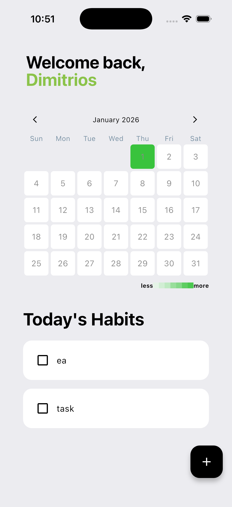
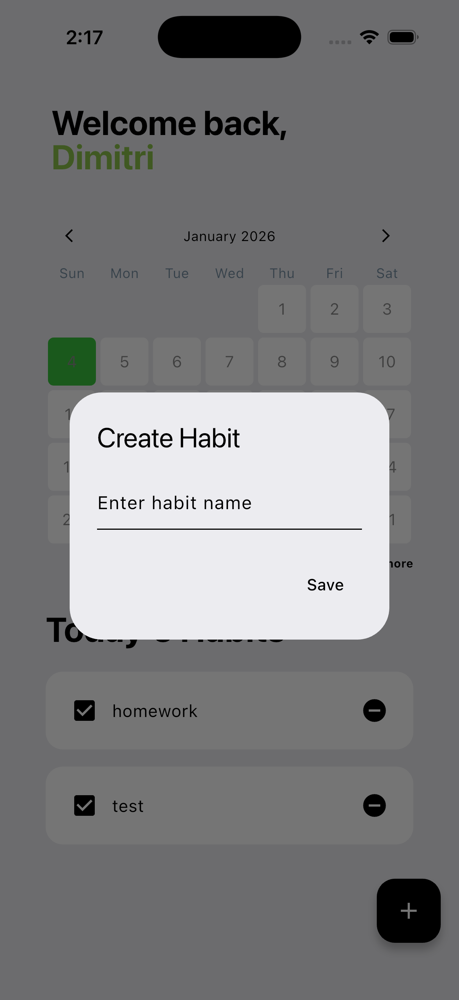

# Flutter-Habit-Tracker
⚠️ **Note:** This project is for **learning purposes**.  
I created it while learning Flutter, so the code may be messy or not follow best practices.  
Use it as a reference for my learning journey, not as production-ready code.

## Overview
A simple Flutter Habit Tracking app with heatmap focused on saving to Hive database and using state.

## Features
- Add Habits
- Delete Habits
- Check Habits when completed
- Store Habits in Hive database
- Heatmap to see habits completed each day

## What it Looks Like

  
  

